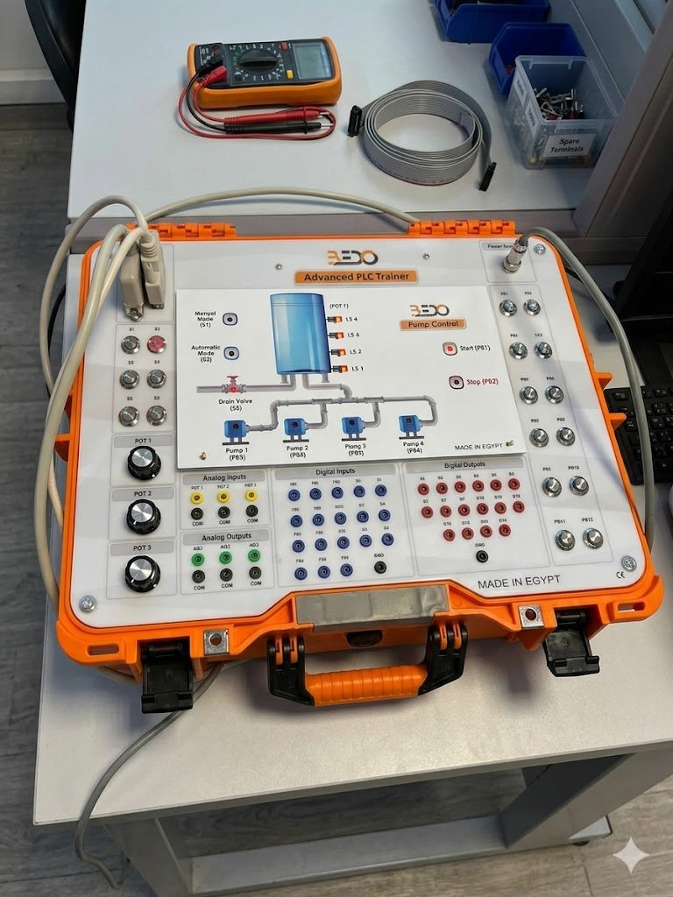

# 💧 Pump Control System


> Automated water tank filling system using four pumps and four float-level sensors. Pumps shut off sequentially as the tank fills, and a drain valve opens at maximum capacity to prevent overflow.

**Author:** Andraws Samoel Sobhy Baskhron Saad
**Course:** Programmable Logic Controllers (MAE311) — Mechatronics & Automation Engineering  
**Supervisors:** Assoc. Prof. Islam Mohamed · Assoc. Prof. Mohamed Salah Selmy  
**Hardware:** BEDO Advanced PLC Trainer · Siemens S7-1200 CPU 1214C DC/DC/DC  
**Software:** Siemens TIA Portal · LAD (Ladder Diagram)

---



---

## How It Works

Four pumps fill the tank simultaneously at minimum level. As water rises and triggers each sensor, one pump shuts off at a time — gradually reducing the inflow rate instead of cutting off abruptly. At maximum capacity, all pumps stop and the drain valve opens.

```
                        ┌──────────────────────┐
                        │        POT 1         │
                        │                      │
   Drain valve opens ── │ ─── LS4 (max)  ───── │ ── P1 + P2 OFF
                        │                      │
            P3 OFF ──── │ ─── LS3 (mid-high) ── │
                        │                      │
            P4 OFF ──── │ ─── LS2 (low-mid) ─── │
                        │                      │
       All pumps ON ─── │ ─── LS1 (min)  ───── │
                        │                      │
                        └──┬───┬───┬───┬───────┘
                          P1  P2  P3  P4
                        Q1.6 Q1.7 Q1.2 Q1.3
```

| Level Sensor | Address | Active Pumps | Drain Valve |
|:---:|:---:|:---:|:---:|
| Below LS1 | — | None | Closed |
| LS1 | I0.2 | P1 ✅ P2 ✅ P3 ✅ P4 ✅ | Closed |
| LS2 | I0.3 | P1 ✅ P2 ✅ P3 ✅ ~~P4~~ | Closed |
| LS3 | I0.4 | P1 ✅ P2 ✅ ~~P3~~ ~~P4~~ | Closed |
| LS4 | I0.5 | ~~P1~~ ~~P2~~ ~~P3~~ ~~P4~~ | **Open** ✅ |

**Two operating modes:**
| Mode | Selector | Behaviour |
|------|----------|-----------|
| Manual | S1 | Operator runs pumps directly via pushbuttons |
| Automatic | S2 → `I1.4` | PLC controls everything via sensor feedback. Latches `M0.3` (system enable flag) |

---

## Repository Structure

```
pump-control-plc/
│
├── README.md                       ← You are here
│
├── docs/
│   ├── situation.md                ← Objective, control sequence, components
│   ├── water-level-logic.md        ← Detailed sensor-by-sensor logic + design rationale
│   └── float-sensor.md             ← Float level sensor theory, types, and wiring
│
├── ladder-logic/
│   ├── networks.md                 ← All 8 LAD networks — contacts, coils, addresses
│   └── tag-table.md                ← Complete PLC I/O and memory tag table
│
└── assets/
    ├── trainer_photo.jpg           ← BEDO Advanced PLC Trainer hardware
    ├── lad_networks_1-4.jpg        ← TIA Portal screenshot: Networks 1–4
    └── lad_networks_5-8.jpg        ← TIA Portal screenshot: Networks 5–8
```

---

## I/O Quick Reference

### Inputs

| Tag | Address | Device | Function |
|-----|---------|--------|----------|
| `start` | I0.0 | PB1 | Start the system |
| `STOP` | I0.1 | PB2 | Stop and de-latch everything |
| `LS1` | I0.2 | PB3 | Level sensor — minimum |
| `LS2` | I0.3 | PB4 | Level sensor — low-mid |
| `LS3` | I0.4 | PB5 | Level sensor — mid-high |
| `LS4` | I0.5 | PB6 | Level sensor — maximum |
| `AUTO` | I1.4 | S2 | Enable automatic mode |

### Outputs

| Tag | Address | Description |
|-----|---------|-------------|
| `p1` | Q1.6 | Pump 1 |
| `P2` | Q1.7 | Pump 2 |
| `P3` | Q1.2 | Pump 3 |
| `P4` | Q1.3 | Pump 4 |
| `drain_valve` | Q1.5 | Drain valve |
| `IP1`–`IP4` | Q8.5, Q8.4, Q8.0, Q8.3 | Pump panel indicators |
| `I drain_valve` | Q8.1 | Drain valve indicator |
| `I START` / `I STOP` / `I Auto` | Q0.5 / Q1.1 / Q1.0 | Status LEDs |

Full tag table → [`ladder-logic/tag-table.md`](ladder-logic/tag-table.md)

---

## Program Structure — Main [OB1]

| Network | Name | Logic |
|---------|------|-------|
| 1 | Auto Latch | `AUTO (I1.4)` + `¬STOP` + `I_START` → latch `M0.3` + `Q1.0` |
| 2 | Start Latch | `start (I0.0)` + `¬STOP` → latch `Q0.5` |
| 3 | Stop Indicator | `¬STOP` + `¬I_START` → `Q1.1` |
| 4 | Pump 1 | `LS1` + `¬LS4` + `M0.3` → latch `Q1.6` + `Q8.5` |
| 5 | Pump 2 | `LS1` + `¬LS4` + `M0.3` → latch `Q1.7` + `Q8.4` |
| 6 | Pump 3 | `LS1` + `¬LS3` + `M0.3` → latch `Q1.2` + `Q8.0` |
| 7 | Pump 4 | `LS1` + `¬LS2` + `M0.3` → latch `Q1.3` + `Q8.3` |
| 8 | Drain Valve | `LS4` + `LS1` + `M0.3` → latch `Q1.5` + `Q8.1` |

Full network details with diagrams → [`ladder-logic/networks.md`](ladder-logic/networks.md)  
TIA Portal screenshots → [`assets/lad_networks_1-4.jpg`](assets/lad_networks_1-4.jpg) · [`assets/lad_networks_5-8.jpg`](assets/lad_networks_5-8.jpg)

---

## How to Reproduce

**In TIA Portal:**
1. New project → Add device → CPU 1214C DC/DC/DC
2. Open `Main [OB1]` → set language to LAD
3. Enter tags from [`ladder-logic/tag-table.md`](ladder-logic/tag-table.md)
4. Enter the 8 networks from [`ladder-logic/networks.md`](ladder-logic/networks.md)  
   *(use the screenshots in `assets/` as visual reference)*
5. Compile → Download to PLC

**On the BEDO trainer:**
1. Wire digital inputs: PB1–PB6 and S2 to the `Digital Inputs` terminal block
2. Wire digital outputs: Q1.x and Q8.x to the `Digital Outputs` terminal block
3. Use banana plug cables to match addresses on the patch panel

**Test sequence:**
```
S2 (Auto) → PB1 (Start) → PB3 (simulate LS1) → all 4 pumps ON
→ PB4 (LS2) → P4 drops → PB5 (LS3) → P3 drops → PB6 (LS4) → P1+P2 drop, drain valve opens
```
